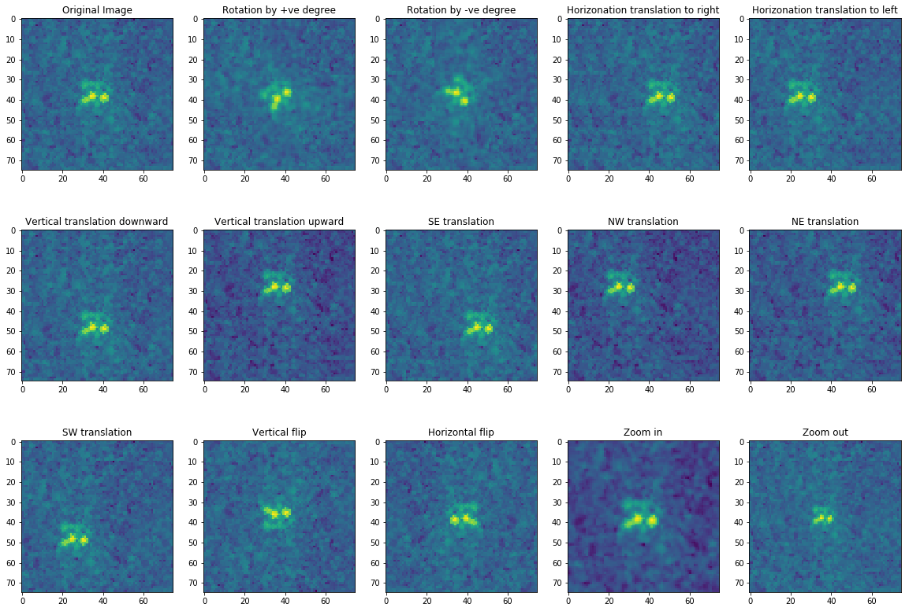

# Statoil iceberg detection using satelite data 

The following notebook represent one of the solution for the Statoil challange hosted on kaggle in which we had to binary classify the data taken from satelites.

There are two highlight of my proposed solution:
- Training data augmentation
- CNN classifier

I used 12 fold augmentation. The augmentation is done in the folowing fashion-
- Rotation by +ve degree
- Rotation by -ve degree
- Horizonation translation to right
- Horizonation translation to left
- Vertical translation downward
- Vertical translation upward
- SE translation
- NW translation
- NE translation
- SW translation
- Vertical flip
- Horizontal flip
- Horizontal flip
- Zoom in
- Zoom out


The score without image augmentation was 0.299 (2556th rank). After augmentation the score was 0.1571(400th rank).
Couple of tweaks and optimazation may yet be needed to generate better result.


```python
import numpy as np
import pandas as pd
from sklearn.model_selection import train_test_split
from os.path import join as opj
from matplotlib import pyplot as plt
from mpl_toolkits.mplot3d import Axes3D
import pylab
plt.rcParams['figure.figsize'] = 20, 14
%matplotlib inline
import math
```


```python
train = pd.read_json("./statoil-iceberg/train.json")
```


```python
train[train['inc_angle']=='na'] = train[train['inc_angle']!='na']['inc_angle'].mean()
train['inc_angle'] = train['inc_angle'].apply(lambda x: math.radians(x))
```


```python
def standardise_vector(vector):
    '''standardise vector'''
    standardised_vector = (np.array(vector) - np.mean(vector)) / np.std(vector)
    return standardised_vector.tolist()
```


```python
train['band_1'] = train['band_1'].apply(standardise_vector)
train['band_2'] = train['band_2'].apply(standardise_vector)
```


```python
def find_missing_data(series, shape):
    
    '''function which return the count and the index of mismatched data'''    
    count = 0
    missing_list = []
    for i,x in enumerate(series):   
        if np.shape(series.iloc[i]) != shape:
            missing_list.append(i)
            count += 1
            
    return missing_list, count
```


```python
missing_list1, count1 = find_missing_data(train.band_1, (5625,))
print("count: ", count1)
```

    count:  133


```python
missing_list2, count2 = find_missing_data(train.band_2, (5625,))
print("count: ", count1)
missing_list1 == missing_list2
```

    count:  133


    True


```python
train =train.drop(train.index[missing_list1])
```


```python
train.head(5)
```


<div>
<style scoped>
    .dataframe tbody tr th:only-of-type {
        vertical-align: middle;
    }

    .dataframe tbody tr th {
        vertical-align: top;
    }

    .dataframe thead th {
        text-align: right;
    }
</style>
<table border="1" class="dataframe">
  <thead>
    <tr style="text-align: right;">
      <th></th>
      <th>band_1</th>
      <th>band_2</th>
      <th>id</th>
      <th>inc_angle</th>
      <th>is_iceberg</th>
    </tr>
  </thead>
  <tbody>
    <tr>
      <th>0</th>
      <td>[0.01182174564467684, 0.27378275943768166, -0....</td>
      <td>[1.1573585860406173, 0.15631457838356574, -0.4...</td>
      <td>dfd5f913</td>
      <td>0.766617</td>
      <td>0.0</td>
    </tr>
    <tr>
      <th>1</th>
      <td>[0.42137323598577087, -0.43078366534450846, -0...</td>
      <td>[-2.0950953014724543, -0.8948057535299927, -0....</td>
      <td>e25388fd</td>
      <td>0.665951</td>
      <td>0.0</td>
    </tr>
    <tr>
      <th>2</th>
      <td>[-0.6969623073924855, -0.6969793944501068, -0....</td>
      <td>[-0.014649839717716016, 0.35157292381049343, 1...</td>
      <td>58b2aaa0</td>
      <td>0.790388</td>
      <td>1.0</td>
    </tr>
    <tr>
      <th>3</th>
      <td>[0.2946591706447792, 0.04985985071106006, -0.3...</td>
      <td>[0.7023040788844376, 0.8569610477684707, 1.005...</td>
      <td>4cfc3a18</td>
      <td>0.764988</td>
      <td>0.0</td>
    </tr>
    <tr>
      <th>4</th>
      <td>[-0.31533024179271146, 0.9175181439939705, 0.9...</td>
      <td>[-0.693769690678262, -2.0346940986353044, -2.0...</td>
      <td>271f93f4</td>
      <td>0.621784</td>
      <td>0.0</td>
    </tr>
  </tbody>
</table>
</div>


```python
band_1 = np.array([np.array(band).astype(np.float32).reshape(75, 75) for band in train["band_1"]])
band_2 = np.array([np.array(band).astype(np.float32).reshape(75, 75) for band in train["band_2"]])
```


```python
labels = train.is_iceberg.as_matrix()
angles = train.inc_angle.as_matrix()
```


```python
# randomly choosing the train and validation indices
train_indices = np.random.choice(len(labels), round(len(labels)*0.75), replace=False)
validation_indices = np.array(list(set(range(len(labels))) - set(train_indices)))
```


```python
# extract train set
band_1_train = band_1[train_indices]
band_2_train = band_2[train_indices]
angles_train = angles[train_indices]
labels_train = labels[train_indices]

# extract validation set
band_1_validation = band_1[validation_indices]
band_2_validation = band_2[validation_indices]
angles_validation = angles[validation_indices]
labels_validation = labels[validation_indices]


# # extract test set
# band_1_test = band_1_test
# band_2_test = band_2_test
# angles_test = test_data.inc_angle.as_matrix()
# iD = test_data.id.as_matrix()
```


```python
# Converting the data to floating point

band_1_train = band_1_train.astype(np.float32)
band_1_validation = band_1_validation.astype(np.float32)
# band_1_test = band_1_test.astype(np.float32)
band_2_train = band_2_train.astype(np.float32)
band_2_validation = band_2_validation.astype(np.float32)
# band_2_test = band_2_test.astype(np.float32)
angles_train = angles_train.astype(np.float32)
angles_validation = angles_validation.astype(np.float32)
# angles_test = angles_test.astype(np.float32)
labels_train = labels_train.astype(np.float32)
labels_validation = labels_validation.astype(np.float32)
# iD = iD.astype(np.str)
```


```python
from agument import *
plt.rcParams['figure.figsize'] = (20.0, 14.0)
image = band_1_train[3].copy()
plt.subplot(3, 5, 1)
plt.title("Original Image")
plt.imshow(image)
plt.subplot(3, 5, 2)
generated_image = rotate_image(image,40)
plt.title("Rotation by +ve degree")
plt.imshow(generated_image)
plt.subplot(3, 5, 3)
generated_image = rotate_image(image,-40)
plt.title("Rotation by -ve degree")
plt.imshow(generated_image)
plt.subplot(3, 5, 4)
generated_image = translate_horizontal(image,10)
plt.title("Horizonation translation to right")
plt.imshow(generated_image)
plt.subplot(3, 5, 5)
generated_image = translate_horizontal(image,-10)
plt.title("Horizonation translation to left")
plt.imshow(generated_image)
plt.subplot(3, 5, 6)
generated_image = translate_vertical(image,10)
plt.title("Vertical translation downward")
plt.imshow(generated_image)
plt.subplot(3, 5, 7)
generated_image = translate_vertical(image,-10)
plt.title("Vertical translation upward")
plt.imshow(generated_image)
plt.subplot(3, 5, 8)
generated_image = translate_positive_diagonal(image,10)
plt.title("SE translation")
plt.imshow(generated_image)
plt.subplot(3, 5, 9)
generated_image = translate_positive_diagonal(image,-10)
plt.title("NW translation")
plt.imshow(generated_image)
plt.subplot(3, 5, 10)
generated_image = translate_negative_diagonal(image,10)
plt.title("NE translation")
plt.imshow(generated_image)
plt.subplot(3, 5, 11)
generated_image = translate_negative_diagonal(image,-10)
plt.title("SW translation")
plt.imshow(generated_image)
plt.subplot(3, 5, 12)
generated_image = flip(image,0)
plt.title("Vertical flip")
plt.imshow(generated_image)
plt.subplot(3, 5, 13)
generated_image = flip(image,1)
plt.title("Horizontal flip")
plt.imshow(generated_image)
plt.subplot(3, 5, 14)
generated_image = zoom(image,10)
plt.title("Zoom in")
plt.imshow(generated_image)
plt.subplot(3, 5, 15)
generated_image = zoom(image,-10)
plt.title("Zoom out")
plt.imshow(generated_image)
plt.show()
```





```python
def augment_data(band1, band2, angles, labels):
    
    '''a function to augment band1 and band2 image'''
    
    # list to store the generated data
    band1_generated = []
    band2_generated = []
    angles_generated = []
    labels_generated = []
    
    # iterate through each point in train set
    for i in range(labels.shape[0]):
        
        # rotate by positive degree
        angle = np.random.randint(5,20)
        band1_generated.append(rotate_image(band1[i],angle)) 
        band2_generated.append(rotate_image(band2[i],angle))
        angles_generated.append(angles[i])
        labels_generated.append(labels[i])
        
        # rotate by negative degree
        angle = np.random.randint(5,20)
        band1_generated.append(rotate_image(band1[i],-angle)) 
        band2_generated.append(rotate_image(band2[i],-angle))
        angles_generated.append(angles[i])
        labels_generated.append(labels[i])
        
        # positive horizontal shift
        shift = np.random.randint(3,7)
        band1_generated.append(translate_horizontal(band1[i],+shift)) 
        band2_generated.append(translate_horizontal(band2[i],+shift))
        angles_generated.append(angles[i])
        labels_generated.append(labels[i])
        
        # negative horizontal shift
        shift = np.random.randint(3,7) 
        band1_generated.append(translate_horizontal(band1[i],-shift)) 
        band2_generated.append(translate_horizontal(band2[i],-shift))
        angles_generated.append(angles[i])
        labels_generated.append(labels[i])
        
        # positive vertical shift
        shift = np.random.randint(0,7)  
        band1_generated.append(translate_vertical(band1[i],+shift)) 
        band2_generated.append(translate_vertical(band2[i],+shift))
        angles_generated.append(angles[i])
        labels_generated.append(labels[i])
        
        # negative vertical shift
        shift = np.random.randint(3,7) 
        band1_generated.append(translate_vertical(band1[i],-shift)) 
        band2_generated.append(translate_vertical(band2[i],-shift))
        angles_generated.append(angles[i])
        labels_generated.append(labels[i])
        
        # translate along positive diagonal in positive direction
        shift = np.random.randint(3,7)  
        band1_generated.append(translate_positive_diagonal(band1[i],+shift)) 
        band2_generated.append(translate_positive_diagonal(band2[i],+shift))
        angles_generated.append(angles[i])
        labels_generated.append(labels[i])
        
        # translate along positive diagonal in negative direction
        shift = np.random.randint(3,7)  
        band1_generated.append(translate_positive_diagonal(band1[i],-shift)) 
        band2_generated.append(translate_positive_diagonal(band2[i],-shift))
        angles_generated.append(angles[i])
        labels_generated.append(labels[i])
        
        # translate along negative diagonal in positive direction
        shift = np.random.randint(3,7)   
        band1_generated.append(translate_negative_diagonal(band1[i],+shift)) 
        band2_generated.append(translate_negative_diagonal(band2[i],+shift))
        angles_generated.append(angles[i])
        labels_generated.append(labels[i])
        
        # translate along negative diagonal in negative direction
        shift = np.random.randint(3,7)   
        band1_generated.append(translate_negative_diagonal(band1[i],-shift)) 
        band2_generated.append(translate_negative_diagonal(band2[i],-shift))
        angles_generated.append(angles[i])
        labels_generated.append(labels[i])
        
        # vertical flip
        band1_generated.append(flip(band1[i],0)) 
        band2_generated.append(flip(band2[i],0))
        angles_generated.append(angles[i])
        labels_generated.append(labels[i])
        
        # horizontal flip
        band1_generated.append(flip(band1[i],1)) 
        band2_generated.append(flip(band2[i],1))
        angles_generated.append(angles[i])
        labels_generated.append(labels[i])
        
        # zoom in image
        zoom_shift = np.random.randint(2,5)
        band1_generated.append(zoom(band1[i],zoom_shift)) 
        band2_generated.append(zoom(band2[i],zoom_shift))
        angles_generated.append(angles[i])
        labels_generated.append(labels[i])
        
        # zoom out image
        zoom_shift = np.random.randint(2,5) 
        band1_generated.append(zoom(band1[i],-zoom_shift)) 
        band2_generated.append(zoom(band2[i],-zoom_shift))
        angles_generated.append(angles[i])
        labels_generated.append(labels[i])        
        
    # convert the generated data into numpy array
    band1_generated = np.array(band1_generated)
    band2_generated = np.array(band2_generated)
    angles_generated = np.array(angles_generated)
    labels_generated = np.array(labels_generated)
    
    # concatenate the generated data to original train set
    band1_augmented = np.concatenate((band1, band1_generated),axis=0)
    band2_augmented = np.concatenate((band2, band2_generated),axis=0)
    angles_augmented = np.concatenate((angles, angles_generated),axis=0)
    labels_augmented = np.concatenate((labels, labels_generated),axis=0)
    
    return band1_augmented, band2_augmented, angles_augmented, labels_augmented
```


```python

band_1_train, band_2_train, angles_train, labels_train = \
    augment_data(band_1_train, band_2_train, angles_train, labels_train)
    
print("Shape of band_1_train:",band_1_train.shape)
print("Shape of band_2_train:",band_2_train.shape)
print("Shape of angles_train:",angles_train.shape)
print("Shape of labels_train:",labels_train.shape)
```

    Shape of band_1_train: (16545, 75, 75)
    Shape of band_2_train: (16545, 75, 75)
    Shape of angles_train: (16545,)
    Shape of labels_train: (16545,)


```python
image_train = np.concatenate([band_1_train[:, :, :, np.newaxis],
                             band_2_train[:, :, :, np.newaxis],
                             ((band_1_train+band_2_train)/2)[:, :, :, np.newaxis]],
                             axis=-1)
```


```python
image_validation = np.concatenate([band_1_validation[:, :, :, np.newaxis],
                             band_2_validation[:, :, :, np.newaxis],
                             ((band_1_validation+band_2_validation)/2)[:, :, :, np.newaxis]],
                             axis=-1)
```


```python
print("Shape of image_train:",image_train.shape)
print("Shape of image_validation:",image_validation.shape)
```

    Shape of image_train: (16545, 75, 75, 3)
    Shape of image_validation: (368, 75, 75, 3)


```python
import plotly.offline as py
import plotly.graph_objs as go
py.init_notebook_mode(connected=True)

def plotmy3d(c, name):
    data = [go.Surface(z=c)]
    layout = go.Layout(
        title=name,
        autosize=False,
        width=700,
        height=700,
        margin=dict(
            l=65,
            r=50,
            b=65,
            t=90
        )
    )
    fig = go.Figure(data=data, layout=layout)
    py.iplot(fig)
plotmy3d(band_1_train[17,:,:], 'Ship!!!')
```


```python
del(band_1_train, band_1_validation, band_2_train, band_2_validation)
```


```python
from matplotlib import pyplot
from keras.preprocessing.image import ImageDataGenerator
from keras.models import Sequential
from keras.layers import Conv2D, MaxPooling2D, Dense, Dropout, Input, Flatten, Activation
from keras.layers import GlobalMaxPooling2D
from keras.layers.normalization import BatchNormalization
from keras.layers.merge import Concatenate
from keras.models import Model
from keras import initializers
from keras.optimizers import Adam
from keras.callbacks import ModelCheckpoint, Callback, EarlyStopping
```

    /usr/local/lib/python3.5/dist-packages/h5py/__init__.py:36: FutureWarning:
    
    Conversion of the second argument of issubdtype from `float` to `np.floating` is deprecated. In future, it will be treated as `np.float64 == np.dtype(float).type`.
    
    Using TensorFlow backend.


```python
def getModel():
    #Building the model
    gmodel=Sequential()
    #Conv Layer 1
    gmodel.add(Conv2D(64, kernel_size=(3, 3),activation='relu', input_shape=(75, 75, 3)))
    gmodel.add(MaxPooling2D(pool_size=(3, 3), strides=(2, 2)))
    gmodel.add(Dropout(0.2))

    #Conv Layer 2
    gmodel.add(Conv2D(128, kernel_size=(3, 3), activation='relu' ))
    gmodel.add(MaxPooling2D(pool_size=(2, 2), strides=(2, 2)))
    gmodel.add(Dropout(0.2))

#     #Conv Layer 3.1
#     gmodel.add(Conv2D(256, kernel_size=(3, 3), activation='relu'))
#     gmodel.add(MaxPooling2D(pool_size=(2, 2), strides=(2, 2)))
#     gmodel.add(Dropout(0.2))
    
    #Conv Layer 3.2
    gmodel.add(Conv2D(128, kernel_size=(3, 3), activation='relu'))
    gmodel.add(MaxPooling2D(pool_size=(2, 2), strides=(2, 2)))
    gmodel.add(Dropout(0.2))

    #Conv Layer 4
    gmodel.add(Conv2D(64, kernel_size=(3, 3), activation='relu'))
    gmodel.add(MaxPooling2D(pool_size=(2, 2), strides=(2, 2)))
    gmodel.add(Dropout(0.2))

    #Flatten the data for upcoming dense layers
    gmodel.add(Flatten())

    #Dense Layers
    gmodel.add(Dense(512))
    gmodel.add(Activation('relu'))
    gmodel.add(Dropout(0.2))

    #Dense Layer 2
    gmodel.add(Dense(256))
    gmodel.add(Activation('relu'))
    gmodel.add(Dropout(0.2))

    #Sigmoid Layer
    gmodel.add(Dense(1))
    gmodel.add(Activation('sigmoid'))

    mypotim=Adam(lr=0.001, beta_1=0.9, beta_2=0.999, epsilon=1e-08, decay=0.0)
    gmodel.compile(loss='binary_crossentropy',
                  optimizer=mypotim,
                  metrics=['accuracy'])
    gmodel.summary()
    return gmodel
```


```python
X_train_cv, _, y_train_cv,_ = train_test_split(image_train, labels_train, random_state=1, train_size=0.90)

_, X_valid,_,  y_valid = train_test_split(image_validation, labels_validation, random_state=1, train_size=0.10)
```

    /usr/local/lib/python3.5/dist-packages/sklearn/model_selection/_split.py:2026: FutureWarning:
    
    From version 0.21, test_size will always complement train_size unless both are specified.
    


```python
del (image_train, image_validation, labels_train, labels_validation)
```


```python
import os
gmodel=getModel()
gmodel.fit(X_train_cv, y_train_cv,
          batch_size=24,
          epochs=8,
          verbose=1,
          validation_data=(X_valid, y_valid))
```

    _________________________________________________________________
    Layer (type)                 Output Shape              Param #   
    =================================================================
    conv2d_1 (Conv2D)            (None, 73, 73, 64)        1792      
    _________________________________________________________________
    max_pooling2d_1 (MaxPooling2 (None, 36, 36, 64)        0         
    _________________________________________________________________
    dropout_1 (Dropout)          (None, 36, 36, 64)        0         
    _________________________________________________________________
    conv2d_2 (Conv2D)            (None, 34, 34, 128)       73856     
    _________________________________________________________________
    max_pooling2d_2 (MaxPooling2 (None, 17, 17, 128)       0         
    _________________________________________________________________
    dropout_2 (Dropout)          (None, 17, 17, 128)       0         
    _________________________________________________________________
    conv2d_3 (Conv2D)            (None, 15, 15, 128)       147584    
    _________________________________________________________________
    max_pooling2d_3 (MaxPooling2 (None, 7, 7, 128)         0         
    _________________________________________________________________
    dropout_3 (Dropout)          (None, 7, 7, 128)         0         
    _________________________________________________________________
    conv2d_4 (Conv2D)            (None, 5, 5, 64)          73792     
    _________________________________________________________________
    max_pooling2d_4 (MaxPooling2 (None, 2, 2, 64)          0         
    _________________________________________________________________
    dropout_4 (Dropout)          (None, 2, 2, 64)          0         
    _________________________________________________________________
    flatten_1 (Flatten)          (None, 256)               0         
    _________________________________________________________________
    dense_1 (Dense)              (None, 512)               131584    
    _________________________________________________________________
    activation_1 (Activation)    (None, 512)               0         
    _________________________________________________________________
    dropout_5 (Dropout)          (None, 512)               0         
    _________________________________________________________________
    dense_2 (Dense)              (None, 256)               131328    
    _________________________________________________________________
    activation_2 (Activation)    (None, 256)               0         
    _________________________________________________________________
    dropout_6 (Dropout)          (None, 256)               0         
    _________________________________________________________________
    dense_3 (Dense)              (None, 1)                 257       
    _________________________________________________________________
    activation_3 (Activation)    (None, 1)                 0         
    =================================================================
    Total params: 560,193
    Trainable params: 560,193
    Non-trainable params: 0
    _________________________________________________________________
    Train on 14890 samples, validate on 332 samples
    Epoch 1/8
      14890/14890 [>>>>>>>>>>>>>>>>>>>>>>>>>>>] - ETA: 8:20 - loss: 0.2981 - acc: 0.8541
